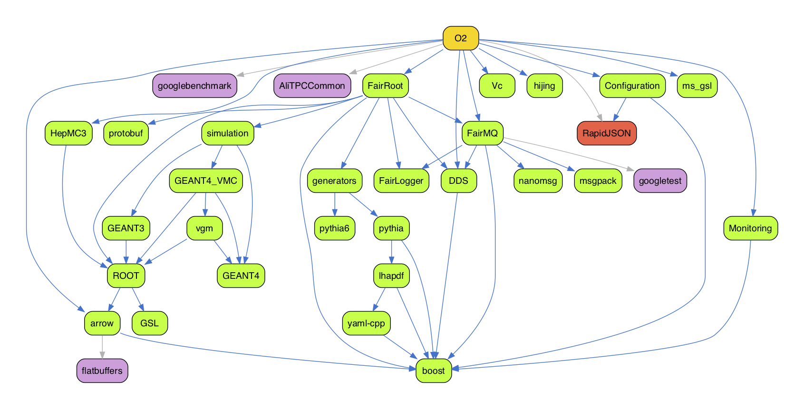

## SYNOPSIS

For a quick start introduction, please look [here](quick.md).

```
aliBuild build [-h] [--defaults DEFAULT]
               [-a ARCH] [--force-unknown-architecture]
               [-z [DEVELPREFIX]] [-e ENVIRONMENT] [-j JOBS] [-u]
               [--no-local PKGLIST] [--force-tracked] [--disable PACKAGE]
               [--force-rebuild PACKAGE] [--annotate PACKAGE=COMMENT]
               [--only-deps] [--plugin PLUGIN]
               [--always-prefer-system | --no-system]
               [--docker] [--docker-image IMAGE] [--docker-extra-args ARGLIST] [-v VOLUMES]
               [--no-remote-store] [--remote-store STORE] [--write-store STORE] [--insecure] 
               [-C DIR] [-w WORKDIR] [-c CONFIGDIR] [--reference-sources MIRRORDIR]
               [--aggressive-cleanup] [--no-auto-cleanup]
               PACKAGE [PACKAGE ...]
```

- `PACKAGE`: One of the packages in `CONFIGDIR`. May be specified multiple
  times.
- `-h`, `--help`: show this help message and exit
- `--defaults DEFAULT`: Use defaults from `CONFIGDIR/defaults-DEFAULT.sh`.
- `-a ARCH`, `--architecture ARCH`: Build as if on the specified architecture.
  When used with `--docker`, build inside a Docker image for the specified
  architecture. Default is the current system architecture.
- `--force-unknown-architecture`: Build on this system, even if it doesn't have
  a supported architecture.
- `-z [DEVELPREFIX]`, `--devel-prefix [DEVELPREFIX]`: Version name to use for
  development packages. Defaults to branch name.
- `-e ENVIRONMENT`: KEY=VALUE binding to add to the build environment. May be
  specified multiple times.
- `-j JOBS`, `--jobs JOBS`: The number of parallel compilation processes to run.
- `-u`, `--fetch-repos`: Fetch updates to repositories in `MIRRORDIR`. Required
  but nonexistent repositories are always cloned, even if this option is not
  given.
- `--no-local PKGLIST`: Do not pick up the following packages from a local
  checkout. `PKGLIST` is a comma-separated list.
- `--force-tracked`: Do not pick up any packages from a local checkout.
- `--disable PACKAGE`: Do not build `PACKAGE` and all its (unique) dependencies.
- `--force-rebuild PACKAGE`: Always rebuild the specified packages from scratch,
  even if they were built before. Has the same effect as adding
  `force_rebuild: true` to the recipe. May be specified multiple times or
  separate multiple arguments with commas.
- `--annotate PACKAGE=COMMENT`: Store `COMMENT` in the build metadata for
  `PACKAGE`. The comment will only be stored if the package is compiled or
  downloaded during this run. May be specified multiple times.
- `--only-deps`: Only build dependencies, not the main package. Useful for
  populating a build cache.
- `--plugin PLUGIN`: Plugin to use for the build. Default is `legacy`.
- `--always-prefer-system`: Always use system packages when compatible.
- `--no-system`: Never use system packages, even if compatible.

### Building inside a container

Builds can be done inside a Docker container, to make it easier to get a common,
usable environment. The Docker daemon must be installed and running on your
system. By default, images from `alisw/<platform>-builder:latest` will be used,
e.g. `alisw/slc8-builder:latest`. They will be fetched if unavailable.

- `--docker`: Build inside a Docker container.
- `--docker-image IMAGE`: The Docker image to build inside of. Implies
  `--docker`. By default, an image is chosen based on the architecture.
- `--docker-extra-args ARGLIST`: Command-line arguments to pass to `docker run`.
  Passed through verbatim -- separate multiple arguments with spaces, and make
  sure quoting is correct! Implies `--docker`.
- `-v VOLUMES`: Additional volume to be mounted inside the Docker container, if
  one is used. May be specified multiple times. Passed verbatim to `docker run`.

### Re-using prebuilt tarballs

Reusing prebuilt tarballs saves compilation time, as common packages need not be
rebuilt from scratch. `rsync://`, `https://`, `b3://` and `s3://` remote stores
are recognised. Some of these require credentials: `s3://` remotes require an
`~/.s3cfg`; `b3://` remotes require `AWS_ACCESS_KEY_ID` and
`AWS_SECRET_ACCESS_KEY` environment variables. A useful remote store is
`https://s3.cern.ch/swift/v1/alibuild-repo`. It requires no credentials and
provides tarballs for the most common supported architectures.

- `--no-remote-store`: Disable the use of the remote store, even if it is
  enabled by default.
- `--remote-store STORE`: Where to find prebuilt tarballs to reuse. See above
  for available remote stores. End with `::rw` if you want to upload (in that
  case, `::rw` is stripped and `--write-store` is set to the same value).
  Implies `--no-system`. May be set to a default store on some architectures;
  use `--no-remote-store` to disable it in that case.
- `--write-store STORE`: Where to upload newly built packages. Same syntax as
  `--remote-store`, except `::rw` is not recognised. Implies `--no-system`.
- `--insecure`: Don't validate TLS certificates when connecting to an `https://`
  remote store.

### Customise aliBuild directories

- `-C DIR`, `--chdir DIR`: Change to the specified directory before building.
  Alternatively, set `ALIBUILD_CHDIR`. Default `.`.
- `-w WORKDIR`, `--work-dir WORKDIR` The toplevel directory under which builds
  should be done and build results should be installed. Default `sw`.
- `-c CONFIGDIR`, `--config-dir CONFIGDIR`: The directory containing build
  recipes. Default `alidist`.
- `--reference-sources MIRRORDIR`: The directory where reference git
  repositories will be cloned. `%(workDir)s` will be substituted by `WORKDIR`.
  Default `%(workDir)s/MIRROR`.

### Cleaning up after building

- `--aggressive-cleanup`: Delete as much build data as possible when cleaning
  up.
- `--no-auto-cleanup`: Do not clean up build directories automatically after a
  build.

## Using precompiled packages

By running aliBuild with no special option on CentOS/Alma 7, 8 or 9 (x86-64 or ARM),
or on Ubuntu 20.04, 22.04 or 24.04 (x86-64), it will automatically try to
use as many precompiled packages as possible by downloading them from a default
central server. By using precompiled packages you lose the ability to pick some
of them from your system. If you do not want to use precompiled packages and you
want to pick as many packages as possible from your system, you should manually
specify the `--always-prefer-system` option.

It is possible to benefit from precompiled builds on every platform, provided
that the server caching the builds is maintained by yourself. Since every build
is stored as a tarball with a unique hash, it is sufficient to provide for a
server or shared space where cached builds will be stored and made available to
others.

In order to specify the cache store, use the option `--remote-store <uri>`,
where `<uri>` can be:

* a local path, for instance `/opt/alibuild_cache`,
* a remote SSH accessible path, `ssh://<host>:<path>`,
* an unencrypted rsync path, `rsync://<host>/path`,
* a CERN S3 bucket, `b3://<bucket>`,
* a HTTP(s) server, `http://<host>/<path>`.

The first four options can also be writable (if you have proper permissions):
if you specify `::rw` at the end of the URL, your builds will be cached there.
This is normally what sysadmins do to precache builds: other users can simply
use the same URL in read-only mode (no `::rw` specified) to fetch the builds.

You need to make sure you have proper filesystem/SSH/rsync permissions of
course.

It is also possible to specify a write store different from the read one by
using the `--write-store` option.

aliBuild can reuse precompiled packages if they were built with a different tag,
if that tag points to the same actual commit that you're building now. (This is
used for the nightly tags, as they are built from a branch named
`rc/nightly-YYYYMMDD`, while alidist is updated to have a tag like
`nightly-YYYYMMDD` instead, pointing to the same commit.) However, this reuse
only works if the precompiled package has the same version as specified in your
copy of alidist.

This approach assumes that tags don't move (i.e. don't change which commit they
are tagging) in the repositories being built. If you administer a cache store,
make sure to delete cached tarballs built using that tag if a tag is moved!

## Developing packages locally

One of the use cases we want to cover is the ability to develop external
packages without having to go through an commit - push - pull cycle.

In order to do so, you can simply checkout the package you want to
develop at the same level as alibuild and alidist.

For example, if you want to build O2 while having the ability to modify
ROOT, you can do the following:

    git clone https://github.com/alisw/alidist
    git clone https://github.com/root-mirror/root ROOT
    <modify files in ROOT/>
    aliBuild ... build O2

The above will make sure the build will pick up your changes in the local
directory.

As a cherry on the cake, in case your recipe does not require any environment,
you can even do:

    cd sw/BUILD/ROOT/latest
    make install

and it will correctly install everything in `sw/<arch>/ROOT/latest`.
This of course mean that for each development package you might end up
with one or more build directories which might increase the used disk
space.

It's also important to notice that if you use your own checkout of a
package, you will not be able to write to any store and the generated
tgz will be empty.

If you wish to temporary compile with the package as specified by
alidist, you can use the `--no-local <PACKAGE>` option.

### Incremental builds

When developing locally using the development mode, if the external
is well behaved and supports incremental building, it is possible to
specify an `incremental_recipe` in the YAML preamble. Such a recipe will
be used after the second time the build happens (to ensure that the non
incremental parts of the build are done) and will be executed directly
in $BUILDDIR, only recompiled what changed. Notice that if this is the
case the incremental recipe will always be executed.

### Forcing a different architecture

While alibuild does its best to find out which OS / distribution you are
using, sometimes it might fail to do so, for example in the case you
start using a new *buntu flavour or a bleeding edge version of a distribution.
In order to force the correct architecture for the build you can use
the `--architecture` (`-a`) flag with one of the supported options:

On Linux, x86-64:
- `slc6_x86-64`: RHEL6 / SLC6 compatible
- `slc7_x86-64`: RHEL7 / CC7 compatible
- `slc8_x86-64`: RHEL8 / CC8 compatible
- `slc9_x86-64`: RHEL9 / ALMA9 compatible
- `ubuntu2004_x86-64`: Ubuntu 20.04 compatible
- `ubuntu2204_x86-64`: Ubuntu 22.04 compatible
- `ubuntu2404_x86-64`: Ubuntu 24.04 compatible
- `fedora33_x86-64`: Fedora 33 compatible
- `fedora34_x86-64`: Fedora 34 compatible

On Linux, ARM:
- `slc9_aarch64`: RHEL9 / ALMA9 compatible

On Linux, POWER8 / PPC64 (little endian):
- `slc7_ppc64`: RHEL7 / CC7 compatible

On Mac:
- `osx_x86-64`: Intel
- `osx_arm64`: Apple Silicon

### Running in Docker

Very often one needs to run on a platform which is different from
the one being used for development. The common use case is that
development happens on a Mac while production runs on some older Linux
distribution like SLC5 or SLC6. In order to improve the experience
of cross platform development aliBuild now offers the ability to run
in [Docker](https://docker.io) via the `--docker` option. When it is
specified the first part of the architecture will be used to construct
the name of the docker container to be used for the build and the build
itself will be performed inside that container. For example if you
specify:

```bash
alibuild --docker -a slc7_x86-64 build ROOT
```

the build itself will happen inside the alisw/slc7-builder Docker
container. Environment variables can be passed to docker by specifying
them with the `-e` option. Extra volumes can be specified with the -v
option using the same syntax used by Docker.

## Defaults

By default, `aliBuild` uses the `o2` defaults (`--defaults o2`), which are
optimized for building the ALICE O2 software stack. The defaults system
allows you to specify different sets of build configurations, compiler
flags, and package versions through the `--defaults` option.

Different defaults can be used to:
- Use different package versions (e.g., different ROOT versions)
- Apply specific compiler flags (e.g., debug builds, optimization levels)
- Enable or disable certain features or packages

To use a different set of defaults, use the `--defaults <name>` option,
which will load settings from `CONFIGDIR/defaults-<name>.sh`. For example,
`--defaults o2-epn` would use the `defaults-o2-epn.sh` file.

For a more complete description of how the defaults system works and how to
create custom defaults, please look at [the reference manual](reference.md#defaults).

## Disabling packages

You can optionally disable certain packages by specifying them as a comma
separated list with the `--disable` option.

It's also possible to disable packages by adding them to the `disable` keyword
of your defaults file (see previous paragraph). See the
[defaults-o2.sh](https://github.com/alisw/alidist/blob/master/defaults-o2.sh)
file for an example of how to disable `mesos` and `MySQL` when
passing `--defaults o2`.

## Controlling which system packages are picked up

When compiling, there is a number of packages which can be picked up
from the system, and only if they are not found, do not have their
devel part installed, or they are not considered good enough they are
recompiled from scratch. A typical example is things like autotools,
zlib or cmake which should be available on a standard developer machine
and we rebuild them as last resort. In certain cases, to ensure full
compatibility on what is done in production it might be desirable to
always pick up our own version of the tools. This can be done by passing
the `--no-system` option to alibuild. On the other hand, there might
be cases in which you want to pick up not only basic tools, but also
advanced ones like ROOT, Geant4, or Pythia from the system, either to
save time or because you have a pre-existing setup which you do not want
to touch. In this case you can use `--always-prefer-system` option which
will try very hard to reuse as many system packages as possible (always
checking they are actually compatible with the one used in the recipe).

## Cleaning up the build area (new in 1.1.0)

Whenever you build using a different recipe or set of sources, alibuild
makes sure that all the dependent packages which might be affected
by the change are rebuild, and it does so in a different directory.
This can lead to the profiliferation of many build / installation
directories, in particular while developing a recipe for a new package
(e.g. a new generator).

In order to remove all past builds and only keep the latest one for each
alidist area you might have used and for each breanch (but not commit)
ever build for a given development package you can use the

    aliBuild clean

subcommand which will do its best to clean up your build and
installation area.

## Upgrading aliBuild

aliBuild can be installed either via `pip`, or by your OS package manager (more info [here](https://alice-doc.github.io/alice-analysis-tutorial/building/custom.html). 

The way to upgrade it depends on your installation method. If you installed it
via `pip`, you can upgrade it by running:

    pip install --upgrade alibuild

In general updating aliBuild is safe and it should never trigger a rebuild or
break compilation of older versions of alidist (i.e. we do try to guarantee
backward compatibility). In no case an update of aliBuild will result in the
update of `alidist`, which users will have to be done separately.
In case some yet to appear bug in alibuild will force us to rebuild a
previously built area, this will be widely publicized and users will get a warning
when running the command.

You can also upgrade / install a specific version of alibuild by specifying it on the 
command line. E.g.:

    pip install alibuild=1.17.23
    

## Rebuilding packages from branches instead of tags

Generally, recipes specify a Git _tag_ name in the `tag:` field. In some cases,
_branch names_ might be used instead (such as `tag: master` or `tag: dev`). In
such a rare case, aliBuild needs to know what is the last branch commit to
determine whether a rebuild is necessary.

Such check by default uses cached information instead of doing very slow queries
to remote servers. This means that aliBuild is fast in determining which
packages to build. However, packages using branch names might not get rebuilt as
expected when new changes are pushed to those branches.

In this case, you can ask aliBuild to update cached branches information by
adding the `-u` or `--fetch-repos` option. Note that by default this is not
needed, it's only for very special use cases (such as centralized builds and
server-side pull request checks).

## Generating a dependency graph

It is possible to generating a PDF with a dependency graph using the `aliBuild deps`
tool. Assuming you run it from a directory containing `alidist`, and you have
Graphviz installed on your system, you can simply run:

    aliBuild deps O2 --outgraph graph.pdf

The example above generates a dependency graph for the package `O2`, and saving
the results to a PDF file named `graph.pdf`. This is what the graph looks like:



Packages in green are runtime dependencies, purple are build dependencies, while
red packages are runtime dependencies in some cases, and build dependencies in
others (this can indicate an error in the recipes).

Connections are color-coded as well: blue connections indicate a runtime
dependency whereas a grey connection indicate a build dependency.

By default, `aliBuild deps` runs the usual system checks to exclude packages that can
be taken from the system. If you want to display the full list of dependencies,
you may want to use:

    aliBuild deps O2 --no-system --outgraph graph.pdf

Additional useful options for `aliBuild deps` include:

- `--neat`: Produce a graph with transitive reduction, removing edges that are
  implied by other paths in the graph. This can make complex dependency graphs
  easier to read.
- `--outdot FILE`: Keep the intermediate Graphviz dot file in `FILE`. Useful if
  you want to manually modify the graph or generate output in different formats.

For example, to generate a simplified graph and keep the dot file:

    aliBuild deps O2 --neat --outdot graph.dot --outgraph graph.pdf

Please run `aliBuild deps --help` for further information.

## Using the packages you have built

### Loading the package environment

Environment for packages built using aliBuild is managed by
[Environment Modules](http://modules.sourceforge.net) and the wrapper script
`alienv`. To list the available packages you can do:

    alienv q

while:

    alienv enter VO_ALICE@PackageA::VersionA[,VO_ALICE@PackageB::VersionB...]

will enter a shell with the appropriate environment set. Note that loading a
toplevel package recursively sets the environment for all its dependencies.

You can also execute a command with the proper environment without altering the
current one. For instance:

    alienv setenv VO_ALICE@AliRoot::latest -c aliroot -b

To see other commands consult the online manual:

    alienv help

Environment Modules is required: the package is usually called
`environment-modules` on Linux, or simply `modules` if using Homebrew on OSX.

Note that `alienv` works exactly like the one found on CVMFS, but for local
packages built with `aliBuild`.

### Environment for packages lacking a module definition

Some packages do not have a modulefile: this usually occurs for those which are
not distributed on the Grid. If you think this is wrong feel free to submit a
[pull request](https://github.com/alisw/alidist/pulls) or
[open an issue](https://github.com/alisw/alidist/issues) to the relevant
packages.

It is still possible to load the environment by sourcing the `init.sh` file
produced for each package under the `etc/profile.d` subdirectory. For instance:

    WORK_DIR=$PWD/sw source sw/slc7_x86-64/AliRoot/v5-08-02-1/etc/profile.d/init.sh

Dependencies are automatically loaded.
